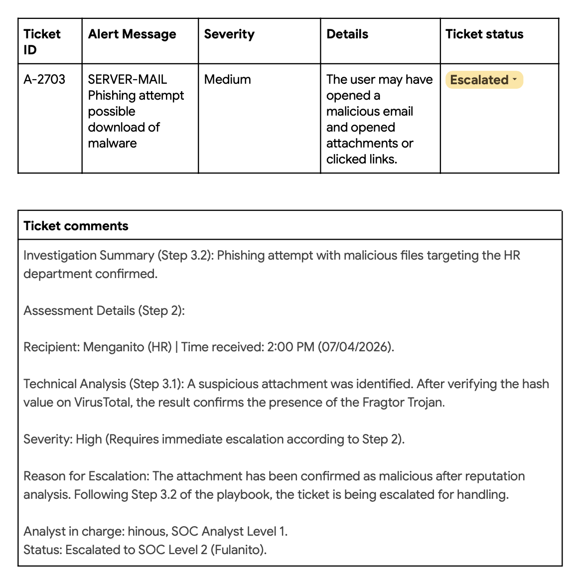
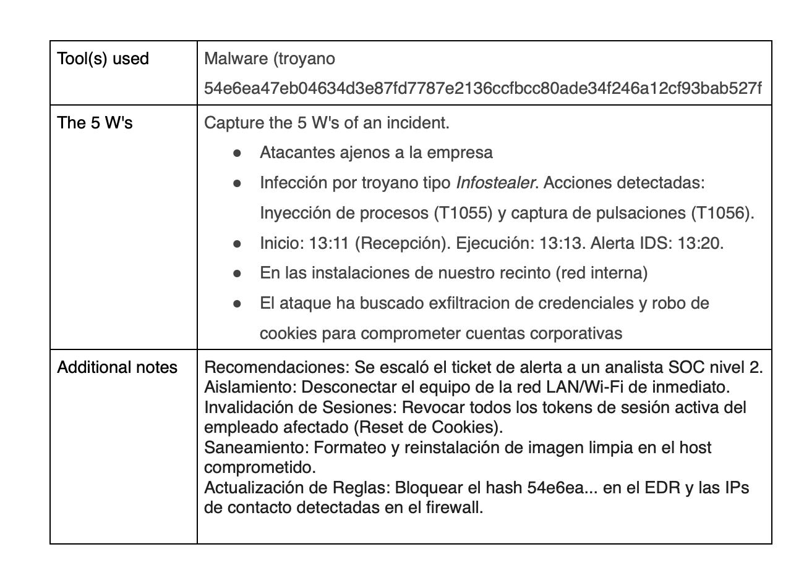

# Use a playbook to respond to a phishing incident
## Es un Ejericio de carreer certificates de cibersguridad de google. 
## NOTA: En este ejercicio no se han tomado medidas de mitigación, porque según el playbook se debía escalar a un analista SOC nivel 2.
#### 
#### 
 #### [Descargar Playbook](/recursos/Phishing_response_playbook.pdf)
  #### [Descargar el ticket](recursos/Alert_ticket.pdf)
 
