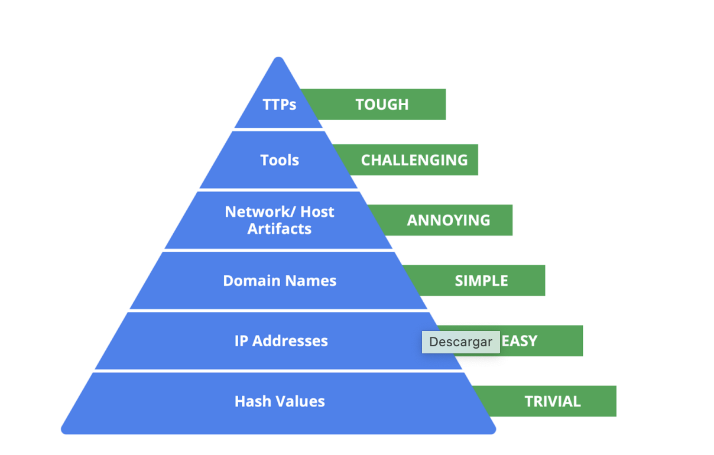

# IOC & IOA

##Estrategia de Detección: La Pirámide del Dolor

Utilizo la **Pyramid of Pain** para clasificar los indicadores de compromiso (IoCs) y maximizar el impacto de la defensa:

| Nivel | Tipo de Indicador | Dificultad para el Atacante | Mi Enfoque |
| :--- | :--- | :--- | :--- |
| **Cima** | TTPs | **Máximo Dolor** | Análisis de comportamiento y tácticas. |
| **Medio** | Herramientas / Artefactos | Difícil / Retador | Detección de software malicioso y rastros en red. |
| **Base** | IPs / Dominios / Hashes | Trivial / Fácil | Bloqueo automático mediante Feeds de Inteligencia. |

> **Objetivo:** Elevar la defensa hacia los TTPs para forzar al atacante a reinventar su estrategia completa.
> 
