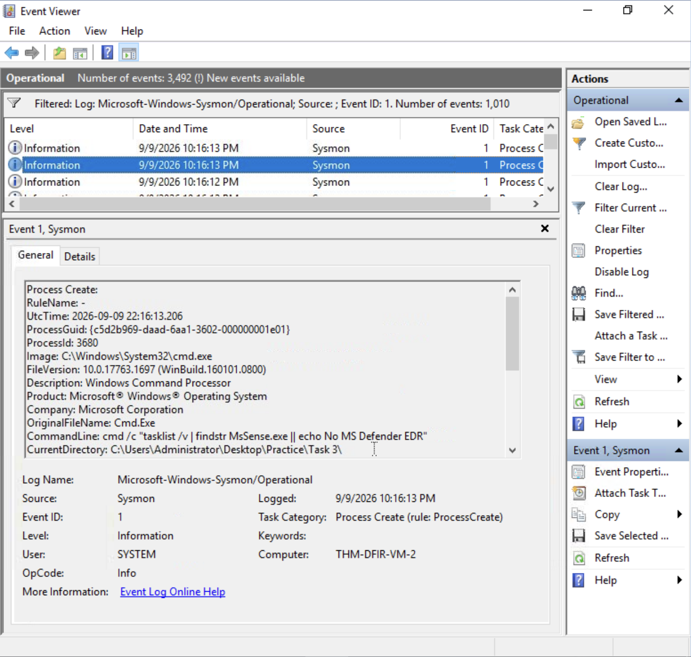
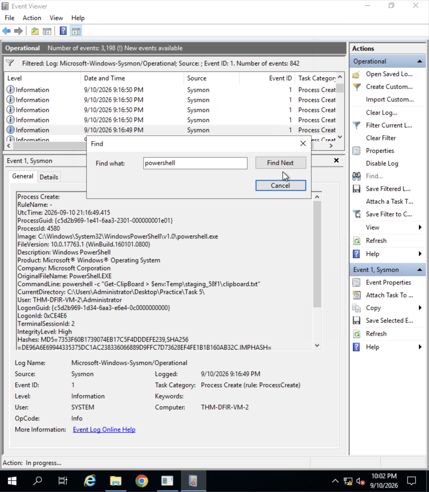
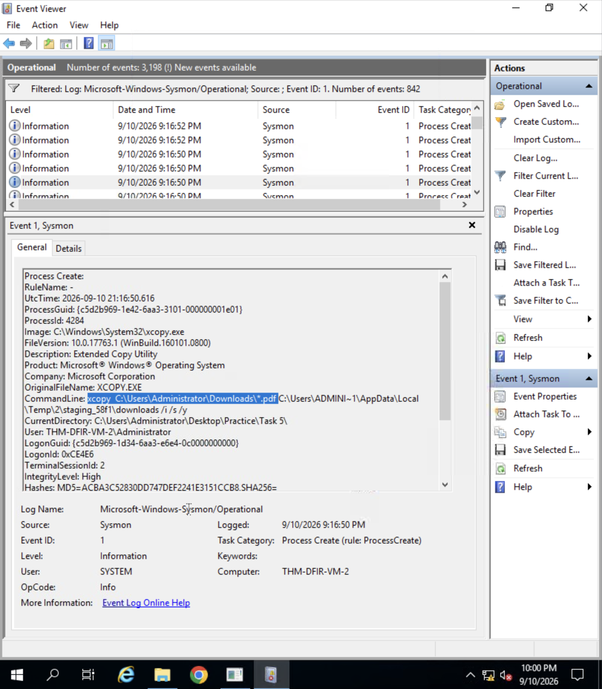
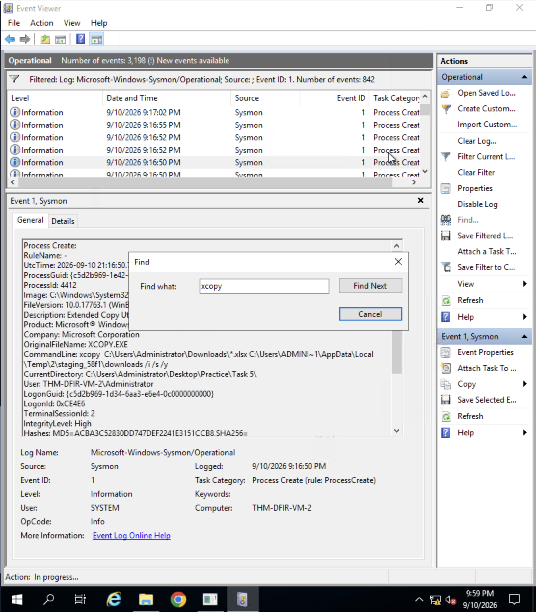
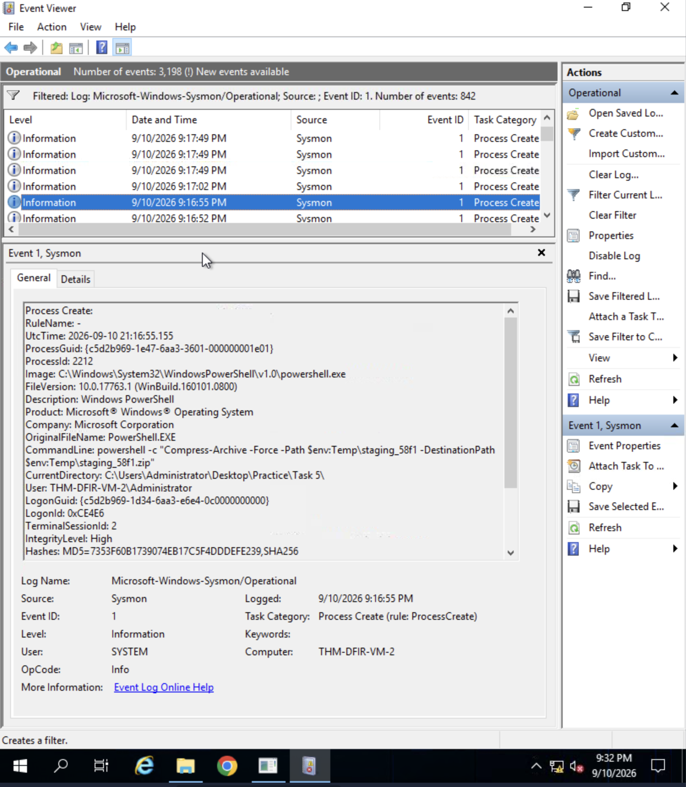
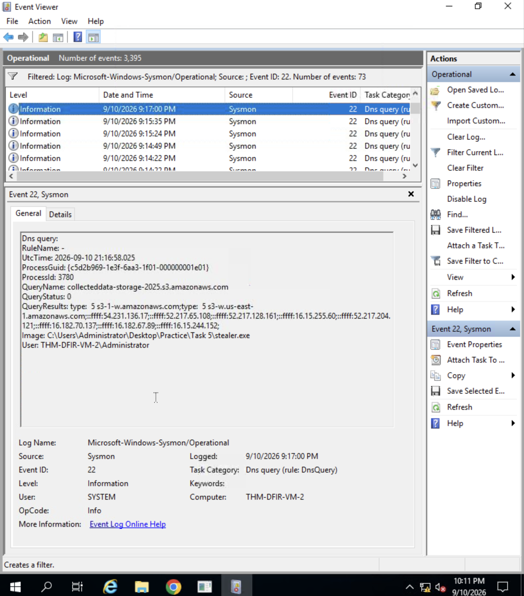

## 2. Local Discovery, Post-Exploitation, and Exfiltration

### A. Discovery Commands Cheatsheet (Post-Exploitation Enumeration)

Once initial access and persistence are established, attackers—and conversely, incident responders conducting live triage—execute native system utilities to map out the environment, identify elevated privileges, locate sensitive files, and check for active security defenses. 

The following cheatsheet outlines the primary discovery commands, their technical objectives, and the specific telemetry events required for effective hunting:

| Category | CMD / PowerShell Command | Adversary Objective / Technical Purpose | Telemetry / Events to Audit |
| :--- | :--- | :--- | :--- |
| **Identity** | `whoami /priv` | Displays privileges assigned to the current access token (e.g., `SeDebugPrivilege`, `SeImpersonatePrivilege`). | Sysmon Event ID 1 / Command Line |
| **Users** | `net user` / `net localgroup administrators` | Enumerates local user accounts and members belonging to high-privilege administrative groups. | Sysmon Event ID 1 (`net.exe`) |
| **System** | `systeminfo` | Gathers operating system version, architecture, and installed patches (Hotfixes) to check for privilege escalation vulnerabilities. | Sysmon Event ID 1 |
| **Network** | `netstat -ano` | Displays active network connections, listening ports, and remote IP addresses mapped to corresponding Process IDs (PIDs). | Sysmon Event ID 1 |
| **Defenses** | `tasklist /v | findstr MsSense.exe` | Identifies whether Endpoint Detection and Response (EDR) agents or Antivirus software (such as Microsoft Defender) are running. | Sysmon Event ID 1 |
| **Clipboard** | `powershell Get-Clipboard` | Extracts passwords, API keys, or text tokens recently copied to memory by the user. | Sysmon Event ID 1 / PowerShell Script Block (4104) |
| **Staging** | `xcopy ... /i /s /y` | Recursively copies directory trees (documents, spreadsheets) to temporary staging directories prior to compression. | Sysmon Event ID 1 / FileCreate (Event ID 11) |

---

### B. DFIR Case Study: Analysis of Evidence

#### 1. Defense Evasion and Security Check
Before proceeding with data aggregation, the adversary queries the running process list to verify if security monitoring software is active. In this telemetry record, the attacker checks specifically for the Microsoft Defender for Endpoint sensor process:

* **Date/Time (UTC):** 2026-09-09 22:16:13.206
* **Event ID:** 1 (Sysmon - Process Create)
* **Image:** `C:\Windows\System32\cmd.exe` (PID: 3680)
* **Command Line:** `cmd /c "tasklist /v | findstr MsSense.exe || echo No MS Defender EDR"`

  

---

#### 2. Initial External Communication Probe
Following reconnaissance, malware samples executing on the endpoint often perform connectivity checks or preliminary DNS lookups to test outbound routing to infrastructure controlled by the threat actor:

* **Date/Time (UTC):** 2026-09-09 22:16:13.622
* **Event ID:** 22 (Sysmon - DNS Query)
* **Image:** `C:\Users\Administrator\Desktop\Practice\Task 3\invoice.pdf.exe` (PID: 1896)
* **Query Name:** `exfil.beecz.cafe`
* **Query Status:** `9003` (NXDOMAIN - Non-Existent Domain)

  

---

#### 3. Information Collection and Staging
With defenses mapped and connectivity confirmed, the threat actor transitions to the **Collection** phase. Sensitive information is systematically harvested from across the user profile and concentrated into a temporary directory designated as `staging_58f1`.

First, the contents of the system clipboard—potentially containing sensitive text credentials or session tokens—are dumped directly into a text file:

* **Clipboard Extraction (PowerShell):**
  * **Date/Time (UTC):** 2026-09-10 21:16:49.415 | **Event ID:** 1
  * **Command Line:** `powershell -c "Get-Clipboard > $env:Temp\staging_58f1\clipboard.txt"`

  

Next, the attacker executes bulk file copy operations using `xcopy` to sweep up document assets, targeting PDF files stored in user directories:

* **Bulk PDF Document Harvesting:**
  * **Date/Time (UTC):** 2026-09-10 21:16:50.616 | **Event ID:** 1
  * **Command Line:** `xcopy C:\Users\Administrator\Downloads\*.pdf C:\Users\ADMINI~1\AppData\Local\Temp\2\staging_58f1\downloads /i /s /y`

  

The data gathering continues by targeting spreadsheet files to capture financial data, project tracking sheets, or corporate records:

* **Bulk Spreadsheet Harvesting:**
  * **Date/Time (UTC):** 2026-09-10 21:16:50 | **Event ID:** 1
  * **Command Line:** `xcopy C:\Users\Administrator\Downloads\*.xlsx C:\Users\ADMINI~1\AppData\Local\Temp\2\staging_58f1\downloads /i /s /y`

  

Once all target files are consolidated within the staging tree, the folder is compressed into a single archive file to prepare for stealthy transfer out of the network:

* **Archive Compression (Staging):**
  * **Date/Time (UTC):** 2026-09-10 21:16:55.155 | **Event ID:** 1
  * **Command Line:** `powershell -c "Compress-Archive -Force -Path $env:Temp\staging_58f1 -DestinationPath $env:Temp\staging_58f1.zip"`

  

---

#### 4. Final Data Exfiltration via DNS
In the final phase of the attack chain, the malicious staging binary (`stealer.exe`) transmits the stolen archive across the internet. To bypass standard web proxies and deep packet inspection firewalls, the malware utilizes a covert channel, encoding data chunks into outbound DNS queries directed toward cloud storage infrastructure:

* **Date/Time (UTC):** 2026-09-10 21:16:58.025
* **Event ID:** 22 (Sysmon - DNS Query)
* **Image:** `C:\Users\Administrator\Desktop\Practice\Task 5\stealer.exe` (PID: 3780)
* **Query Name:** `collecteddata-storage-2025.s3.amazonaws.com`
* **Resolved IP Addresses:** `54.231.136.17`, `52.217.65.108`, `52.217.128.161`, `16.15.255.60`, `52.217.204.121`, `16.182.70.137`, `16.182.67.89`, `16.15.244.152`
* **Query Status:** `0` (SUCCESS)

  

